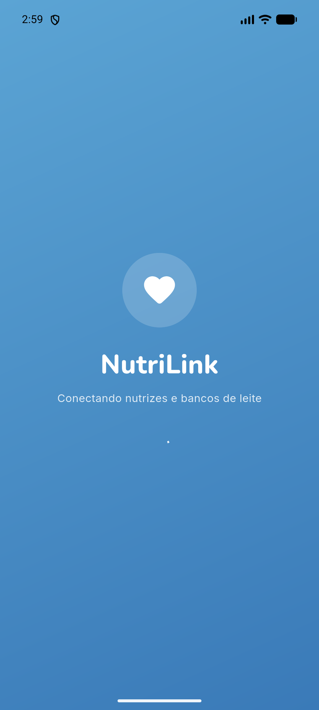
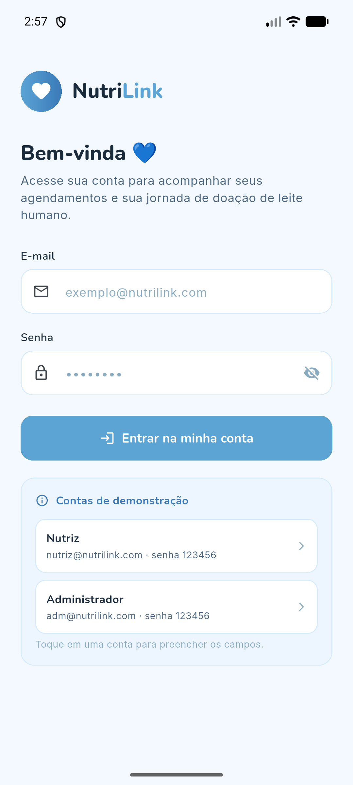
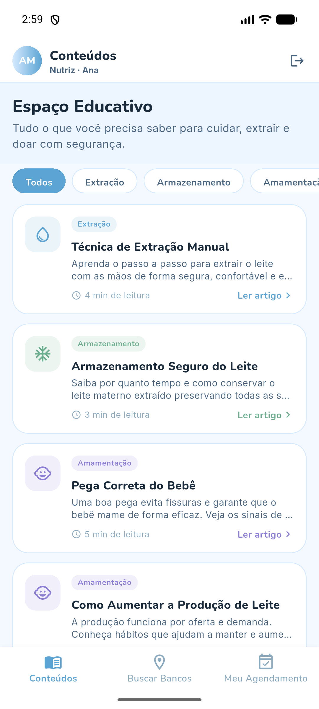
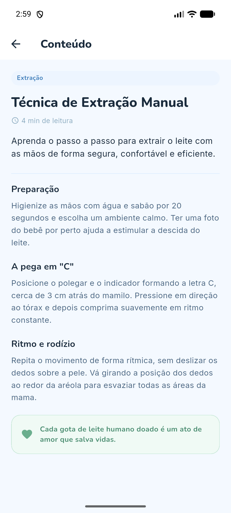
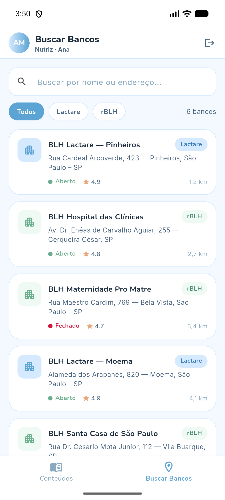
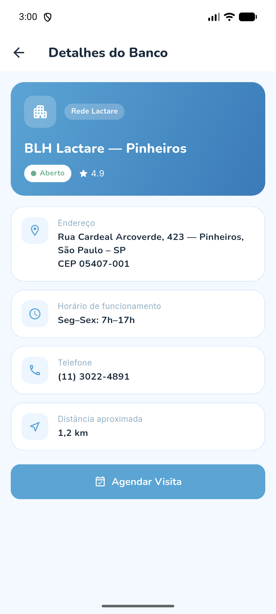
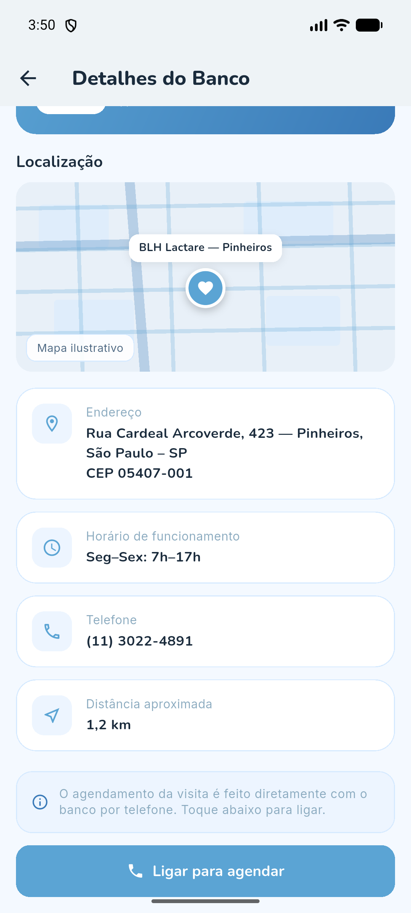
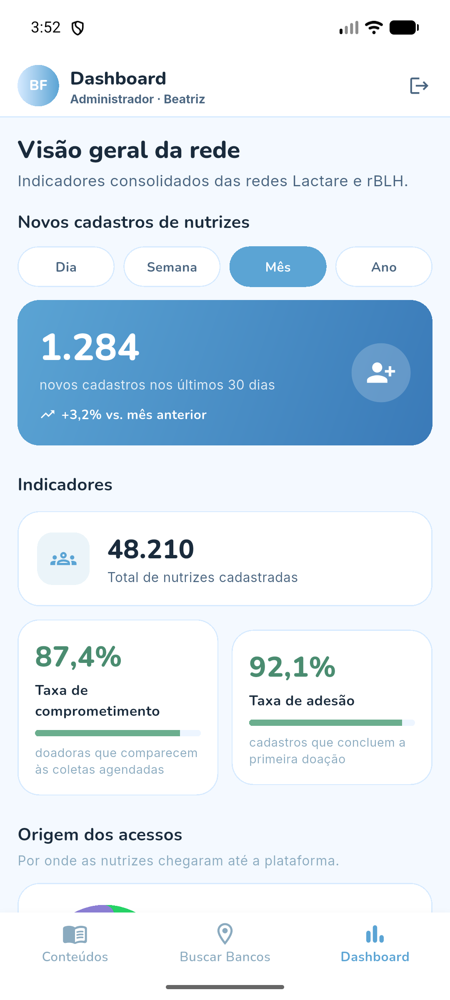
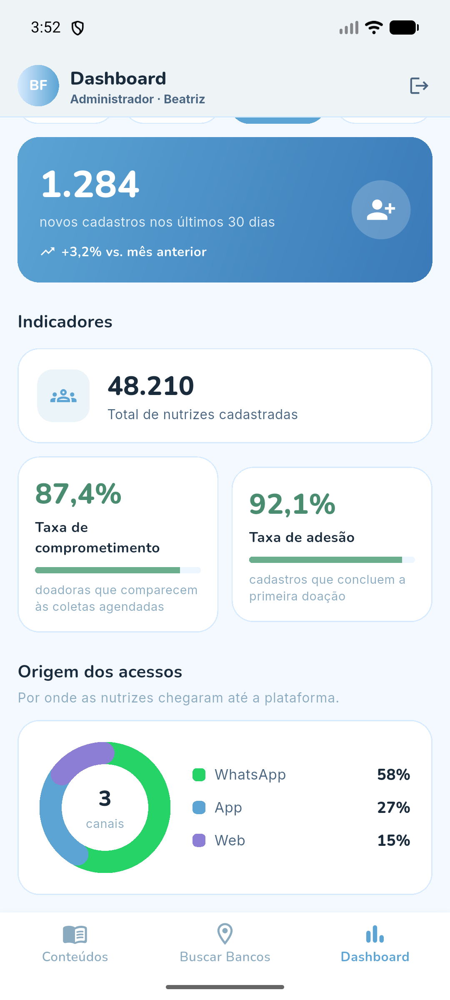

# NutriLink 💙

Aplicativo Android (Flutter) que conecta **nutrizes (mães lactantes)** aos
**Bancos de Leite Humano** das redes **Lactare** e **rBLH**, tornando a doação
de leite materno mais simples, segura e acolhedora.

> Entrega da **Sprint 3** — aplicativo funcional e navegável, construído
> inteiramente com **dados mockados** (sem API, Firebase ou backend).

---

## 👥 Equipe

**Equipe NutriLink**

| Integrante | RM |
|---|---|
| Frederico Nakayama Sant'Anna | 555350 |
| João Pedro Veloso Pilon | 556199 |
| Rodrigo Henrique de Amorim Sena | 555325 |
| Gustavo Bifon de Alcantara | 554588 |
| Ruy Fichman Accioly | 558183 |

---

## 🎯 Objetivo do aplicativo

O NutriLink é o hub digital que aproxima as mães doadoras dos bancos de leite
humano. Pelo app, a nutriz pode:

- **Aprender** com conteúdos educativos (textos + videoaulas) sobre extração,
  armazenamento, amamentação e doação;
- **Encontrar** o banco de leite mais próximo, ver seus detalhes num mapa e
  **ligar** para agendar a visita.

O app também possui um perfil **administrador**, com um **dashboard** de
indicadores da rede — reforçando o controle de acesso por tipo de usuário.

> **Por que o agendamento é por telefone?** Muitos bancos de leite do Brasil
> atendem apenas por telefone fixo. Em vez de simular um ecossistema único de
> agendamento, o app abre o **discador do celular** com o número do banco —
> uma solução realista e coerente com o contexto.

---

## 🔗 Repositório e vídeo

- **Repositório GitHub:** https://github.com/FredericoNakayama/NutriLink---Sprint-3-Flutter.git
- **Vídeo de demonstração:** _<adicionar link do vídeo de navegação>_

---

## 🔑 Acesso (contas de demonstração)

O app abre na tela de login. Use uma das contas mockadas:

| Perfil | E-mail | Senha | Acesso |
|---|---|---|---|
| **Nutriz** | `nutriz@nutrilink.com` | `123456` | Conteúdos, Buscar Bancos |
| **Administrador** | `adm@nutrilink.com` | `123456` | Conteúdos, Buscar Bancos **+ Dashboard** |

> Na própria tela de login há um atalho para preencher as credenciais.

---

## 📱 Telas do aplicativo

### 1. Splash e 2. Login
Abertura com a identidade visual do NutriLink, seguida do login — que valida
as credenciais mockadas e direciona o usuário conforme o perfil.

 

### 3. Conteúdos e 4. Detalhe do Conteúdo
Espaço educativo com guias filtráveis por categoria. Cada guia tem texto e uma
**videoaula** (representada por uma thumbnail mockada). O detalhe é aberto por
**passagem de parâmetro**.

 

### 5. Buscar Bancos e 6. Detalhe do Banco
Listagem dos bancos com busca e filtro por rede (Lactare / rBLH). O detalhe —
recebido por **passagem de parâmetro** — mostra um **mapa ilustrativo** com a
localização, além de endereço, horário e telefone.

 

### 7. Ligar para agendar
Ao tocar em **"Ligar para agendar"**, o app abre o **discador do celular** com
o telefone do banco selecionado.



### 8. Dashboard e 9. Origem dos acessos (somente administrador)
Visão gerencial com **filtro de novos cadastros** por período (dia/semana/mês/
ano), **total de nutrizes cadastradas**, **taxa de comprometimento**, **taxa de
adesão** e um **gráfico** da origem dos acessos (WhatsApp, App, Web).

 

---

## 🧭 Fluxo de navegação

```
Splash → Login ─┬─ (nutriz) → [ Conteúdos | Buscar Bancos ]
                └─ (admin)  → [ Conteúdos | Buscar Bancos | Dashboard ]

Buscar Bancos → Detalhe do Banco → "Ligar para agendar" (abre o discador)
Conteúdos → Detalhe do Conteúdo (texto + videoaula)
```

A navegação usa `Navigator` com `MaterialPageRoute` e **passagem de objetos por
parâmetro** (ex.: o banco escolhido segue para a tela de detalhes; o artigo
selecionado segue para o seu detalhe).

---

## 🏗️ Arquitetura e organização

Código separado por responsabilidade:

```
lib/
├── main.dart                  # ponto de entrada
├── app.dart                   # MaterialApp + tema + rota inicial
├── core/theme/                # cores e ThemeData (Material 3)
├── models/                    # classes de dados (User, MilkBank, ContentArticle, ...)
├── data/                      # dados mockados (bancos, conteúdos, dashboard, usuários)
├── widgets/                   # componentes reutilizáveis (cards, mapa mockado, gráfico, vídeo)
└── screens/                   # telas, agrupadas por funcionalidade
    ├── splash/
    ├── login/
    ├── shell/                 # BottomNavigationBar por perfil
    ├── contents/
    ├── banks/
    └── dashboard/
```

**Dados mockados** ficam concentrados em `lib/data/`, modelados por classes em
`lib/models/` — nada de dados espalhados diretamente nas telas.

**Tecnologias/conceitos:** Flutter, Material Design 3, `StatefulWidget` +
`setState`, `TextEditingController`, `Form`/validação, `Navigator`,
`CustomPainter` (mapa e gráfico donut mockados), `url_launcher` (abre o
discador), fontes customizadas (Nunito/Inter).

---

## ▶️ Como executar

Pré-requisitos: **Flutter SDK** instalado (`flutter doctor` sem erros
bloqueantes) e um dispositivo/emulador Android.

```bash
# 1. Instalar as dependências
flutter pub get

# 2. Rodar em um emulador ou dispositivo Android conectado
flutter run

# (opcional) Gerar o APK de debug
flutter build apk --debug
```

O app inicia na tela de login — use uma das contas de demonstração acima.
