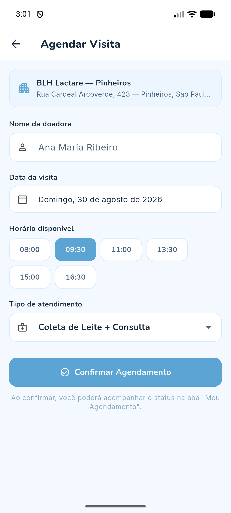
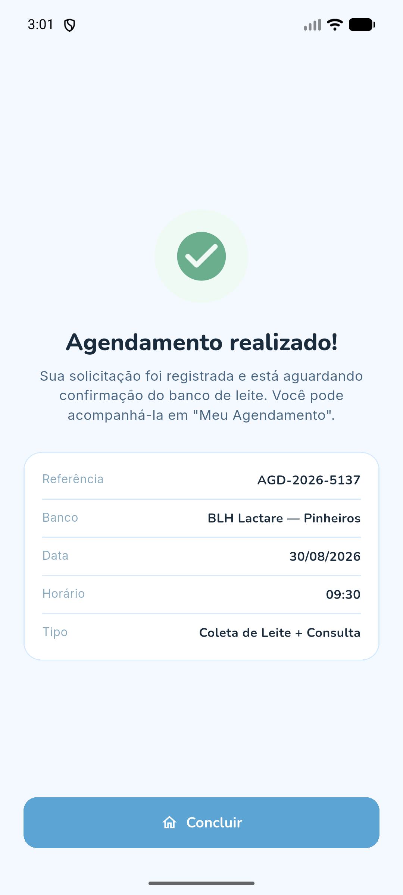
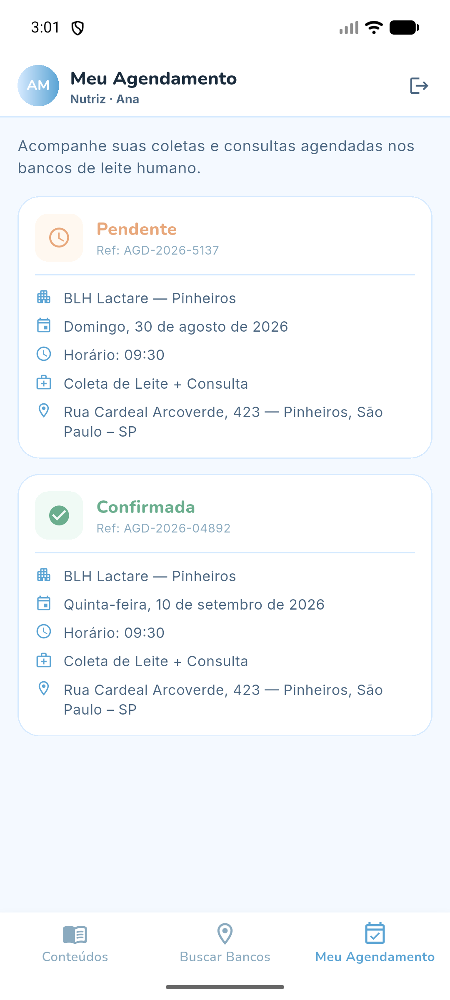
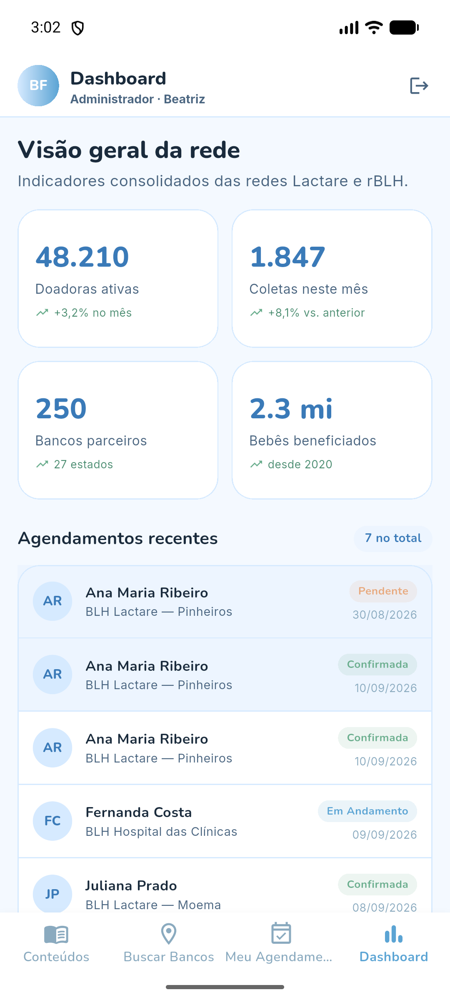

# NutriLink 💙

Aplicativo Android (Flutter) que conecta **nutrizes (mães lactantes)** aos
**Bancos de Leite Humano** das redes **Lactare** e **rBLH**, tornando a doação
de leite materno mais simples, segura e acolhedora.

> Entrega da **Sprint 3** — aplicativo funcional e navegável, construído
> inteiramente com **dados mockados** (sem API, Firebase ou backend).

---

## 👥 Equipe

**Equipe NutriLink**

| Integrante | RM |
|---|---|
| Frederico Nakayama Sant'Anna | 555350 |
| João Pedro Veloso Pilon | 556199 |
| Rodrigo Henrique de Amorim Sena | 555325 |
| Gustavo Bifon de Alcantara | 554588 |
| Ruy Fichman Accioly | 558183 |

---

## 🎯 Objetivo do aplicativo

O NutriLink é o hub digital que aproxima as mães doadoras dos bancos de leite
humano. Pelo app, a nutriz pode:

- **Aprender** com conteúdos educativos sobre extração, armazenamento,
  amamentação e doação;
- **Encontrar** o banco de leite mais próximo e ver seus detalhes;
- **Agendar** uma visita/coleta e **acompanhar** o status do agendamento.

O app também possui um perfil **administrador**, com um **dashboard** de
indicadores da rede — reforçando o controle de acesso por tipo de usuário.

---

## 🔗 Repositório e vídeo

- **Repositório GitHub:** _<adicionar link após criar o repositório>_
- **Vídeo de demonstração:** _<adicionar link do vídeo de navegação>_

---

## 🔑 Acesso (contas de demonstração)

O app abre na tela de login. Use uma das contas mockadas:

| Perfil | E-mail | Senha | Acesso |
|---|---|---|---|
| **Nutriz** | `nutriz@nutrilink.com` | `123456` | Conteúdos, Buscar Bancos, Meu Agendamento |
| **Administrador** | `adm@nutrilink.com` | `123456` | Todas as anteriores **+ Dashboard** |

> Na própria tela de login há um atalho para preencher as credenciais.

---

## 📱 Telas do aplicativo

### 1. Splash
Tela de abertura com a identidade visual do NutriLink, exibida por alguns
instantes antes de encaminhar o usuário ao login.


### 2. Login
Porta de entrada e apresentação do app. Valida e-mail/senha contra as contas
mockadas e direciona o usuário conforme o perfil (nutriz ou administrador).


### 3. Conteúdos
Espaço educativo com guias e artigos, filtráveis por categoria (Extração,
Armazenamento, Amamentação, Doação).


### 4. Detalhe do Conteúdo
Artigo completo, com o texto dividido em seções — recebe o conteúdo
selecionado por **passagem de parâmetro**.


### 5. Buscar Bancos
Listagem dos Bancos de Leite Humano com busca por nome/endereço e filtro por
rede (Lactare / rBLH), mostrando status (aberto/fechado), avaliação e distância.


### 6. Detalhe do Banco
Informações completas do banco selecionado (endereço, horário, telefone,
distância) e botão para iniciar o agendamento — também via **passagem de
parâmetro**.


### 7. Agendar Visita (formulário)
Formulário para agendar a coleta: nome da doadora, data (date picker), horário
e tipo de atendimento, com validações.



### 8. Confirmação
Retorno visual após o agendamento, com o resumo e o número de referência
gerado.



### 9. Meu Agendamento
Lista os agendamentos da nutriz com seus status. Os agendamentos criados no
formulário aparecem aqui automaticamente.



### 10. Dashboard (administrador)
Visão gerencial exclusiva do admin: indicadores da rede e lista de
agendamentos recentes das nutrizes.



---

## 🧭 Fluxo de navegação

```
Splash → Login ─┬─ (nutriz) → [ Conteúdos | Buscar Bancos | Meu Agendamento ]
                └─ (admin)  → [ Conteúdos | Buscar Bancos | Meu Agendamento | Dashboard ]

Buscar Bancos → Detalhe do Banco → Agendar Visita → Confirmação → Meu Agendamento
Conteúdos → Detalhe do Conteúdo
```

A navegação usa `Navigator` com `MaterialPageRoute` e **passagem de objetos por
parâmetro** (ex.: o banco escolhido segue para as telas de detalhe e de
agendamento).

---

## 🏗️ Arquitetura e organização

Código separado por responsabilidade:

```
lib/
├── main.dart                  # ponto de entrada
├── app.dart                   # MaterialApp + tema + rota inicial
├── core/theme/                # cores e ThemeData (Material 3)
├── models/                    # classes de dados (User, MilkBank, Appointment, ...)
├── data/                      # dados mockados + AppointmentStore (estado em memória)
├── widgets/                   # componentes reutilizáveis (botões, cards, badges)
└── screens/                   # telas, agrupadas por funcionalidade
    ├── splash/
    ├── login/
    ├── shell/                 # BottomNavigationBar por perfil
    ├── contents/
    ├── banks/
    ├── appointment/
    └── dashboard/
```

**Dados mockados** ficam concentrados em `lib/data/` (bancos, conteúdos,
usuários, dashboard), modelados por classes em `lib/models/` — nada de dados
espalhados diretamente nas telas.

**Tecnologias/conceitos:** Flutter, Material Design 3, `StatefulWidget` +
`setState`, `TextEditingController`, `Form`/validação, `Navigator`,
`ChangeNotifier` (para refletir novos agendamentos entre telas), fontes
customizadas (Nunito/Inter).

---

## ▶️ Como executar

Pré-requisitos: **Flutter SDK** instalado (`flutter doctor` sem erros
bloqueantes) e um dispositivo/emulador Android.

```bash
# 1. Instalar as dependências
flutter pub get

# 2. Rodar em um emulador ou dispositivo Android conectado
flutter run

# (opcional) Gerar o APK de debug
flutter build apk --debug
```

O app inicia na tela de login — use uma das contas de demonstração acima.
